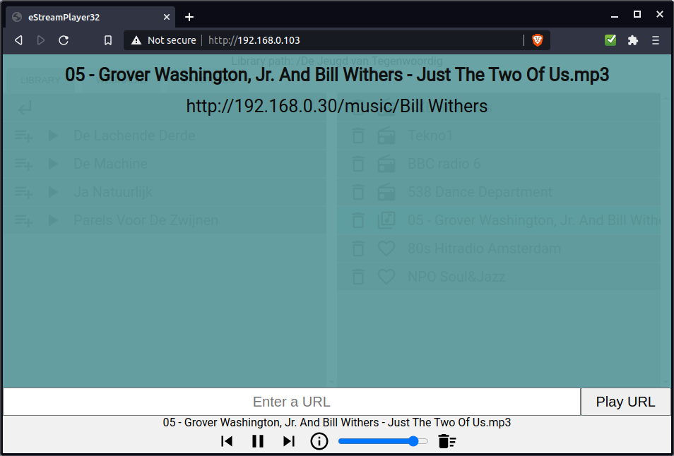
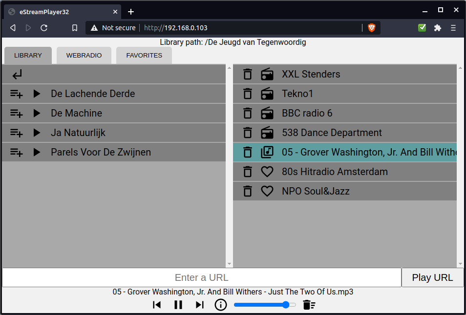
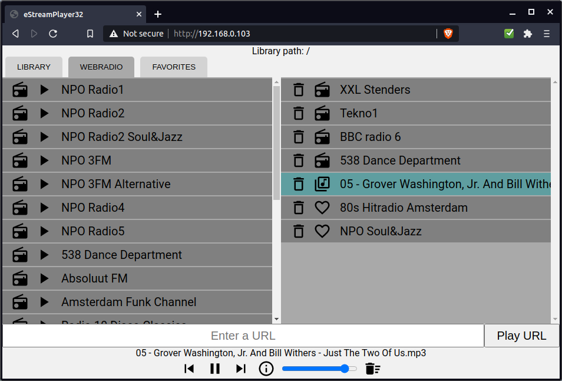
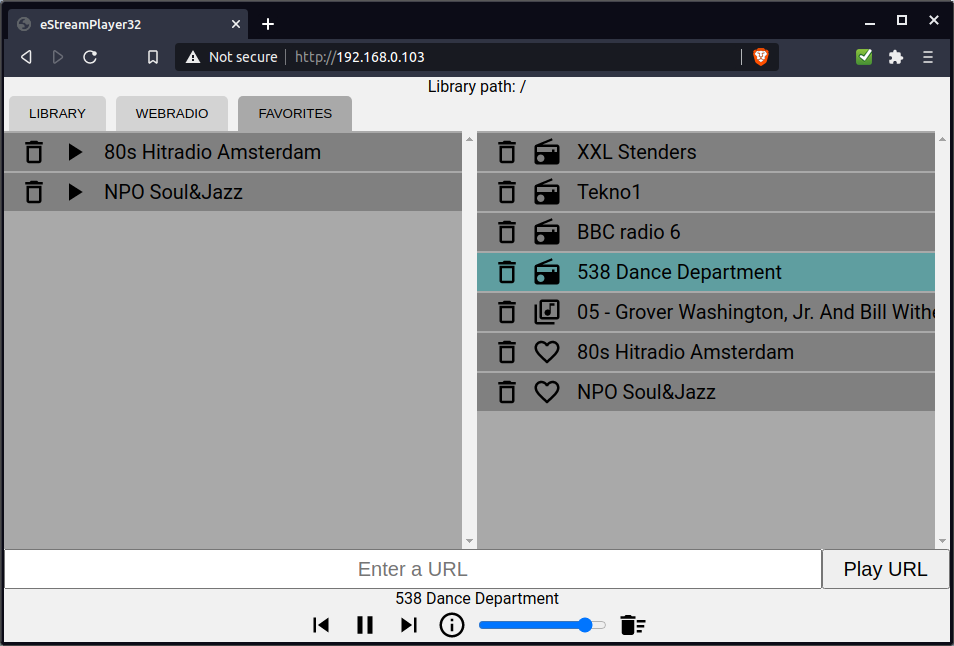

# eStreamPlayer32_VS1053

A web-based esp32 program to play webradio and mp3/aac/wav files from a lamp or llmp server.
Sound output comes from a separate VS1053 mp3/aac/ogg/wav decoder breakout board.

Supports http, https (insecure mode) and chunked streams.

Plays mp3, ogg, aac and aac+ streams.

### What does it do?

-  play preset radio stations
-  play your local files
-  you can play new urls and save these to favorites
-  you can control the music player with your phone, pc or tablet


### Limitations

eStreamPlayer is written for playback over http(s). What this means is that you will need a (lamp or llmp) webserver to play back your local files.<br>This is because the esp32 does not speak NFS or SMB which are common ways to share files over a network. Instead eStreamPlayer uses a php script on the server to navigate the music folders. Copy this script to the server to use your music library.<br>**This is totally insecure and should only be used on a LAN!**

But if you don't have a local music server you can still use eStreamPlayer to tune in to web radio stations and add your own radio stations to presets and favorites.

### Webinterface screenshots

#### File info overlay



#### LIBRARY tab



#### WEBRADIO tab



#### FAVORITES tab



### Setup

Use [the latest ESP32 Arduino Core](https://github.com/espressif/arduino-esp32/releases/latest) to compile.

1.  Download and install [ESP_VS1053_Library](https://github.com/baldram/ESP_VS1053_Library/releases/latest), [ESP32_VS1053_Stream](https://github.com/CelliesProjects/ESP32_VS1053_Stream), [AsyncTCP](https://github.com/me-no-dev/AsyncTCP) and  [ESPAsyncWebServer](https://github.com/me-no-dev/ESPAsyncWebServer) in the Arduino libraries folder.
2.  Download and unzip the [latest eStreamPlayer release](https://github.com/CelliesProjects/eStreamPlayer32_VS1053/releases/latest).
3.  Copy the php script (found in the `copy to server` folder) to your music folder on the server.
4.  Open `eStreamPlayer_vs1053.ino` in the Arduino IDE.
5.  Select `Tools->Partition Scheme->No OTA(2MB APP/2MB FATFS`).
<br>If your board does not have that option you can select `ESP32 Dev Module` in `Tools->Board`.
6.  Open `system_setup.h` and set your wifi credentials and set `SCRIPT_URL` to the php script location set in step #3.<br>Set up `LIBRARY_USER` and `LIBRARY_PWD` if your local library requires login.
7.  Flash the sketch to your esp32. Set `Tools->Core Debug Level->Info` before you flash so you can grab the ip address from the serial port.
8.  On first boot or after a flash erase the fatfs has to be formatted. This will take a couple of seconds.
<br>You can monitor the boot/formatting progress on the serial port.
<br>Flashing an update will not erase the fatfs data.
<br>**Note:** Take care to select the same partition table when updating otherwise the partition will be formatted.
9.  Browse to the ip address shown on the serial port.

### Software needed

-  [ESP_VS1053_Library](https://github.com/baldram/ESP_VS1053_Library/releases/latest) -> [GNU General Public License v3.0](https://github.com/baldram/ESP_VS1053_Library/blob/master/LICENSE.md)
-  [ESP32_VS1053_Stream](https://github.com/CelliesProjects/ESP32_VS1053_Stream) -> [MIT license](https://github.com/CelliesProjects/ESP32_VS1053_Stream/blob/master/LICENSE.md).
-  [AsyncTCP](https://github.com/me-no-dev/AsyncTCP) (LGPL-3.0 License)
-  [ESPAsyncWebServer](https://github.com/me-no-dev/ESPAsyncWebServer) (LGPL-3.0 License)
-  A [lamp](https://en.wikipedia.org/wiki/LAMP_%28software_bundle%29) or llmp webstack to serve local files.
 Apache2 and lighttpd were tested and should work. The php script should be fairly version agnostic.


### Libraries used in the web interface

-  The used icons are from [material.io](https://material.io/tools/icons/?style=baseline) and are [available under Apache2.0 license](https://www.apache.org/licenses/LICENSE-2.0.html).
-  [Reconnecting WebSocket](https://github.com/joewalnes/reconnecting-websocket) which is [available under MIT licence](https://github.com/joewalnes/reconnecting-websocket/blob/master/LICENSE.txt).
-  [Google Roboto font](https://fonts.google.com/specimen/Roboto) which is [available under Apache2.0 license](https://www.apache.org/licenses/LICENSE-2.0.html).
-  [jQuery 3.4.1](https://code.jquery.com/jquery-3.4.1.js) which is [available under MIT license](https://jquery.org/license/).

````
MIT License

Copyright (c) 2020 Cellie

Permission is hereby granted, free of charge, to any person obtaining a copy
of this software and associated documentation files (the "Software"), to deal
in the Software without restriction, including without limitation the rights
to use, copy, modify, merge, publish, distribute, sublicense, and/or sell
copies of the Software, and to permit persons to whom the Software is
furnished to do so, subject to the following conditions:

The above copyright notice and this permission notice shall be included in all
copies or substantial portions of the Software.

THE SOFTWARE IS PROVIDED "AS IS", WITHOUT WARRANTY OF ANY KIND, EXPRESS OR
IMPLIED, INCLUDING BUT NOT LIMITED TO THE WARRANTIES OF MERCHANTABILITY,
FITNESS FOR A PARTICULAR PURPOSE AND NONINFRINGEMENT. IN NO EVENT SHALL THE
AUTHORS OR COPYRIGHT HOLDERS BE LIABLE FOR ANY CLAIM, DAMAGES OR OTHER
LIABILITY, WHETHER IN AN ACTION OF CONTRACT, TORT OR OTHERWISE, ARISING FROM,
OUT OF OR IN CONNECTION WITH THE SOFTWARE OR THE USE OR OTHER DEALINGS IN THE
SOFTWARE.
````
